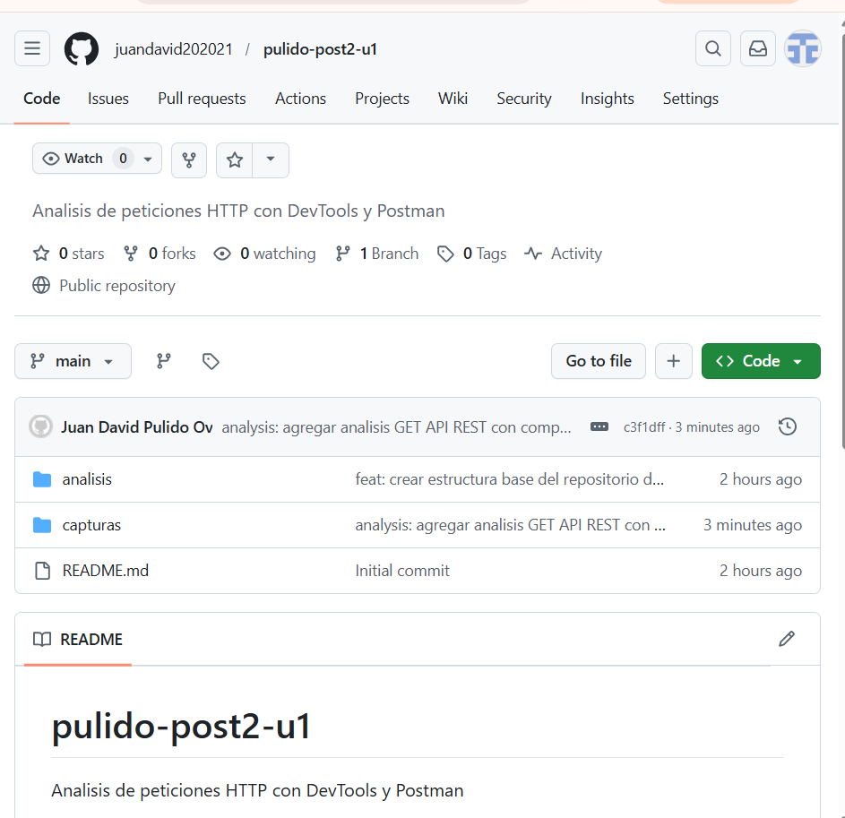

# pulido-post2-u2
Laboratorio: Formulario de Registro con Validación HTML5

# Crear README.md con el siguiente contenido:
# Formulario de Registro HTML5 — [Nombre Apellido]
## Descripción
Formulario de registro universitario desarrollado como laboratorio de
la Unidad 2 del curso de Programación Web. Implementa más de 10 tipos
de input de HTML5 con validación nativa, agrupación semántica con
fieldset/legend y atributos de accesibilidad ARIA.
## Tipos de input implementados
- text, email, password, tel, url, date
- number, range, color, file
- checkbox, radio, hidden
- textarea, select (con optgroup)
## Cómo ejecutar
1. Clonar: `git clone [URL-del-repo]`
2. Abrir en VS Code → clic derecho en registro.html → Open with Live
Server
3. Navegar a `http://localhost:5500/registro.html`
## Capturas de pantalla

# Commits del laboratorio
git add registro.html .gitignore
git commit -m "feat: estructura base y fieldset datos personales"
git add registro.html
git commit -m "feat: fieldsets datos cuenta, academicos y preferencias"
git add README.md img/captura-01.png
git commit -m "docs: README con lista de inputs y captura de pantalla"
git remote add origin https://github.com/[usuario]/apellido-post2-u2.git
git push -u origin main
